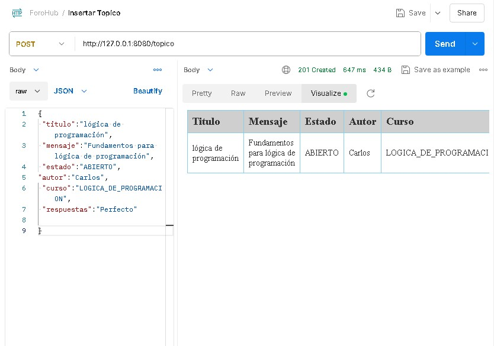

<h1 align="center">FOROHUB</h1>
<h1 align="center">
  
   
  
  
  
  
  
    
</h1>

## Preview

 

  

 

## Description
ForoHub es una plataforma de discusión en línea creada con el framework Spring Boot en Java, diseñada para facilitar la creación, gestión y participación en foros de discusión. El proyecto implementa operaciones CRUD (Crear, Leer, Actualizar, Eliminar) a través de una API REST, interactuando con una base de datos MySQL para almacenar y recuperar información de manera eficiente.

## Usage
Esta Aplicación es con fines educativos, para poner en practica conocimientos adquiridos durante los diversos cursos de Programación orientada a Objetos con Java + SpringBoot

## Author
 © JCodev11-2024

## Support
https://www.linkedin.com/in/jcodev/

## License
MIT
